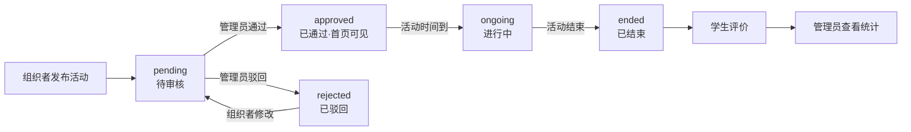
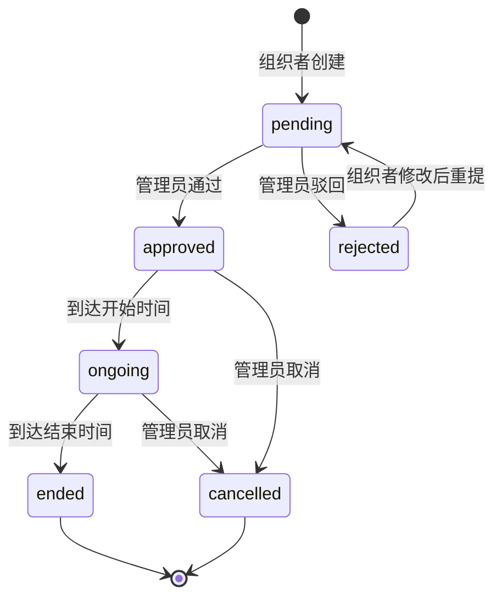

# 校园活动管理系统 — 答辩演示稿

> **用途**：上半部分是给老师看的项目概览（可打印），下半部分是答辩现场的演示脚本和问答速查。

---

# 第一部分：项目概览

## 项目信息

| 项目 | 内容 |
|------|------|
| 课题名称 | 校园活动管理系统 |
| 技术栈 | Vue 3 + Element Plus / Spring Boot + MyBatis-Plus / MySQL 8.0 |
| 项目规模 | 后端 50 个 Java 文件（9 个 Controller，28 个 API），前端 7 个 Vue 页面，7 张数据库表 |
| 开发方式 | Git 管理，60+ 次迭代提交 |

## 系统简介

本系统是一个面向高校的校园活动管理平台，将活动发布、审核、报名、签到、评价等流程迁移到线上，实现一站式管理。

**业务流程**：组织者发布活动 → 管理员审核 → 审核通过后活动上线展示 → 学生浏览、报名 → 活动当天签到/签退 → 结束后评价 → 管理员通过仪表盘查看统计数据。

**三种角色**：

- **学生**：浏览活动列表（支持分类筛选、关键词搜索、多维度排序），报名活动，活动当天签到签退，结束后对活动进行 1-5 星评分和文字评价
- **组织者**：创建和编辑活动，审核通过后活动自动上线；可查看自己活动的报名名单和签到记录
- **管理员**：拥有全局管理权限——审核活动（通过或驳回），管理所有用户（搜索、禁用/启用），管理活动分类，发布系统公告，通过仪表盘查看活动总数、报名总数、各分类活动分布、状态分布等统计数据

**技术方案**：系统采用前后端分离架构，前端使用 Vue 3 + Element Plus 构建 7 个页面，后端基于 Spring Boot + MyBatis-Plus 提供 28 个 RESTful API。身份认证采用 JWT 无状态 Token 方案，前端通过 Axios 拦截器自动挂载 Token，后端通过 Spring Security 过滤器实现路径级权限控制。数据库使用 MySQL 8.0，共设计 7 张表，覆盖用户、活动、分类、报名、签到、评价、公告全部业务数据。

## 功能模块

| 模块 | 学生 | 组织者 | 管理员 |
|------|:--:|:----:|:----:|
| 浏览活动列表（分类筛选、搜索、排序） | ✅ | ✅ | ✅ |
| 活动报名 / 取消报名 | ✅ | — | — |
| 签到 / 签退 | ✅ | — | — |
| 评价活动（1-5 星评分） | ✅ | — | — |
| 发布活动（自动进入待审核） | — | ✅ | — |
| 管理自己的活动（编辑、查看报名/签到） | — | ✅ | — |
| 活动审核（通过 / 驳回） | — | — | ✅ |
| 用户管理（搜索、禁用/启用） | — | — | ✅ |
| 分类管理、公告管理 | — | — | ✅ |
| 数据统计仪表盘（饼图） | — | — | ✅ |

## 业务流程



## 活动状态流转



## 技术架构

```
浏览器（Vue 3 + Element Plus）
      ↕  RESTful API · JSON · JWT Bearer Token
Spring Boot 2.7
  ├── Controller  接收请求，参数校验，返回统一格式
  ├── Service     业务逻辑，事务管理
  └── Mapper      MyBatis-Plus BaseMapper，免写 SQL
      ↕
MySQL 8.0，7 张表，utf8mb4
```

| 层 | 后端技术 | 前端技术 |
|------|------|------|
| 框架 | Spring Boot 2.7（底层 SSM） | Vue 3（Composition API） |
| ORM | MyBatis-Plus 3.5（BaseMapper + Lambda） | — |
| 安全 | Spring Security + JWT | Axios 拦截器 + 路由守卫 |
| UI | — | Element Plus |
| 构建 | Maven | Vite |
| 其他 | Lombok, Hutool, Jackson | Pinia, Vue Router, ECharts |

## 项目目录结构

```
campus-activity-system/
│
├── backend/                          # Spring Boot 后端（50 个 Java 文件）
│   ├── pom.xml                       #   Maven 依赖清单，声明所有第三方库
│   └── src/main/
│       ├── resources/
│       │   ├── application.yml       #   主配置：数据库连接、端口、JWT 密钥
│       │   └── mapper/               #   MyBatis XML 映射文件目录（BaseMapper 下暂为空）
│       └── java/com/cas/
│           ├── CampusActivityApplication.java  # 启动类，@SpringBootApplication 入口
│           │
│           ├── config/               # 配置层 — 安全、跨域、日期格式等开关面板
│           │   ├── SecurityConfig.java         #   接口权限规则：谁可以访问哪些 API
│           │   ├── JwtAuthFilter.java          #   JWT 过滤器：每次请求解析 Token 并认证
│           │   ├── CorsConfig.java             #   跨域配置：允许前端 5173 访问后端 8080
│           │   ├── MyBatisPlusConfig.java      #   分页插件：自动生成 count + limit SQL
│           │   └── JacksonConfig.java          #   JSON 日期格式：LocalDateTime 序列化
│           │
│           ├── controller/           # 控制层 — 接收 HTTP 请求，调 Service，返回结果
│           │   ├── UserController.java           # 注册、登录、个人信息
│           │   ├── ActivityController.java       # 活动 CRUD、分页列表、详情
│           │   ├── CategoryController.java       # 分类列表
│           │   ├── RegistrationController.java   # 报名、取消、我的报名、报名名单
│           │   ├── SignInController.java         # 签到、签退、签到状态
│           │   ├── ReviewController.java         # 提交评价、评价列表
│           │   ├── NoticeController.java         # 公告列表
│           │   ├── AdminController.java          # 管理员：审核、用户管理、分类/公告管理
│           │   └── DashboardController.java      # 数据统计：总数、分类分布、状态分布
│           │
│           ├── service/              # 服务层接口 — 定义业务方法签名
│           │   ├── UserService.java
│           │   ├── ActivityService.java
│           │   ├── CategoryService.java
│           │   ├── RegistrationService.java
│           │   ├── SignInService.java
│           │   ├── ReviewService.java
│           │   └── NoticeService.java
│           │
│           ├── service/impl/         # 服务层实现 — 真正的业务逻辑在这里
│           │   ├── UserServiceImpl.java            # 注册查重、BCrypt 加密、登录验证
│           │   ├── ActivityServiceImpl.java        # CRUD、状态机、时间刷新、关联填充
│           │   ├── CategoryServiceImpl.java
│           │   ├── RegistrationServiceImpl.java    # 原子报名、防超卖、取消可重报
│           │   ├── SignInServiceImpl.java          # 签到时间窗口校验
│           │   ├── ReviewServiceImpl.java          # 评价权限校验、防重复
│           │   └── NoticeServiceImpl.java
│           │
│           ├── mapper/               # 数据访问层 — 继承 BaseMapper，免写 SQL
│           │   ├── UserMapper.java       → users 表
│           │   ├── ActivityMapper.java   → activities 表
│           │   ├── CategoryMapper.java   → categories 表
│           │   ├── RegistrationMapper.java → registrations 表
│           │   ├── SignInMapper.java     → sign_ins 表
│           │   ├── ReviewMapper.java     → reviews 表
│           │   └── NoticeMapper.java     → notices 表
│           │
│           ├── entity/               # 实体类 — Java 对象 ↔ 数据库表映射
│           │   ├── User.java             users 表，字段：username, role, status 等
│           │   ├── Activity.java         activities 表，含关联展示字段
│           │   ├── Category.java         categories 表
│           │   ├── Registration.java     registrations 表
│           │   ├── SignIn.java           sign_ins 表
│           │   ├── Review.java           reviews 表
│           │   └── Notice.java           notices 表
│           │
│           ├── dto/                  # 数据传输对象 — 前端和后端之间的快递箱
│           │   ├── LoginDTO.java           登录：username + password
│           │   ├── RegisterDTO.java        注册：含手机号正则校验
│           │   ├── ActivitySaveDTO.java    创建/编辑活动：含 @JsonFormat 日期
│           │   └── ActivityQueryDTO.java   查询条件：分页、分类、关键词、排序
│           │
│           ├── common/               # 公共类 — 全项目共用
│           │   ├── Result.java              统一返回 { code, message, data }
│           │   └── GlobalExceptionHandler.java 全局异常捕获 → 友好提示
│           │
│           └── util/                 # 工具类
│               ├── JwtUtil.java             Token 生成、解析、校验
│               └── SecurityUtil.java        获取当前用户 ID 和角色
│
├── frontend/                         # Vue 3 前端（20 个源文件）
│   ├── index.html                    #   浏览器入口 HTML
│   ├── package.json                  #   npm 依赖清单
│   ├── vite.config.js                #   Vite 配置：@ 别名、端口 5173、/api 代理
│   └── src/
│       ├── main.js                   #   入口：装配 Pinia + Router + Element Plus
│       ├── App.vue                   #   根组件：导航栏（按角色显隐）+ 页面切换
│       │
│       ├── router/index.js           #   路由 — 7 条路由 + beforeEach 登录守卫
│       │
│       ├── api/                      #   接口层 — 前后端通信的唯一通道
│       │   ├── request.js              Axios 实例：拦截器挂 Token + 统一错误处理
│       │   └── index.js                所有 API 函数（9 组，按模块分类）
│       │
│       ├── store/auth.js             #   状态管理 — 登录信息共享（token + userInfo）
│       │
│       └── views/                    #   页面 — 7 个 Vue 组件
│           ├── Login.vue               登录 + 注册表单，表单校验
│           ├── Home.vue                首页：搜索 + 分类筛选 + 卡片网格 + 分页
│           ├── ActivityDetail.vue      活动详情 + 报名/签到/评价按钮
│           ├── MyActivities.vue        我的报名列表 + 签到/签退入口
│           ├── ActivityManage.vue      组织者：发布/编辑活动 + 查看名单/签到
│           ├── Admin.vue               管理员：仪表盘 + 用户/审核/分类/公告 + 饼图
│           └── Profile.vue             个人中心：信息展示 + 编辑
│
├── docs/                             # 开发文档
│   ├── schema.sql                    #   建表 DDL（7 张表）
│   ├── data.sql                      #   测试数据（26 条活动 + 用户 + 报名等）
│   ├── 网络实训报告.md                #   含 6 张表格
│   └── Java框架报告.md                #   含摘要、关键词、参考文献
│
├── report/                           # 答辩资料
│   ├── 答辩演示稿.md                  #   本文档
│   ├── 前端技术详细介绍.md            #   7 项前端技术详解
│   ├── 后端技术详细介绍.md            #   8 项后端技术详解
│   ├── 项目文件说明.md                #   逐文件用途说明
│   └── 命名规范说明.md                #   命名规则速查
│
└── image/                            # 截图素材
```

---

# 第二部分：演示

## 准备

已分别登录：

| 窗口 | 账号 | 密码 | 角色 |
|------|------|------|------|
| ① | `organizer01` | `123456` | 组织者（张老师） |
| ② | `admin` | `123456` | 管理员 |
| ③ | `student01` | `123456` | 学生（王同学） |

---

## 演示步骤

### 步骤 1：学生视角 — 浏览活动

**窗口 ③**，已登录 `student01`

✅ 首页活动卡片列表（CSS Grid 响应式）  
✅ 点击分类按钮筛选  
✅ 搜索框输入关键词  
✅ 点击卡片进入详情页  
✅ 评价列表（星星评分 + 文字）

首页只展示"已通过"和"进行中"的活动，待审核的学生看不到，是在后端查询时过滤的。

---

### 步骤 2：组织者视角 — 发布活动

切换到**窗口 ①**，已登录 `organizer01`

✅ 导航栏："活动管理"（学生没有这个入口）  
✅ 点击"发布活动" → 填写表单 → 提交  
✅ 状态自动变成"待审核"

组织者创建后直接进入待审核

---

### 步骤 3：管理员视角 — 审核活动

切换到**窗口 ②**，已登录 `admin`

✅ 导航栏只有"首页"和"后台管理"  
✅ 后台管理 → 数据概览（统计卡片 + 饼图）  
✅ 活动审核 → 刚才的活动在待审列表里  
✅ 点击"通过" → 状态变为"已通过"

切回**窗口 ③**，刷新首页 → 活动出现，学生可以报名了。

管理员驳回后，组织者修改活动会自动回到待审核

---

### 步骤 4：学生视角 — 报名

切回**窗口 ③**

✅ 点击刚才通过的活动 → 详情页  
✅ 点击"立即报名" → 报名人数 +1  
✅ "我的活动"页面 → 看到报名记录  
✅ 签到按钮 + 签退按钮

报名用了数据库原子更新——`WHERE current_participants < max_participants`，不会超卖。

---

### 步骤 5：管理员全貌

**窗口 ②**，后台管理标签页：

✅ 全部活动 → 按状态筛选  
✅ 用户管理 → 搜索 + 禁用/启用（自保护：不能禁自己）  
✅ 分类管理 → 添加/删除  
✅ 公告管理 → 发布公告 → 窗口 ③ 首页顶部能看到  

---

### 可选步骤：驳回重提

**窗口 ②** → 审核 → 驳回一个活动  
→ **窗口 ①** → 活动管理 → 看到"被驳回"  
→ 编辑 → 提交 → 自动变回"待审核"  
→ **窗口 ②** → 重新审核通过  

---

## 技术讲解

### JWT 认证流程

登录 → 后端发 Token（含 userId + role）→ 前端存 localStorage → Axios 拦截器每次自动挂 Header → JwtAuthFilter 解析 → SecurityContext → Controller 拿到当前用户。整个过程服务器不存 Session。

### 并发报名安全
不是简单 insert，而是 `UPDATE ... SET count = count + 1 WHERE count < max`，数据库层面原子操作，不加锁也能防超卖。

### 状态机

7 种状态，每个操作都有状态校验——不能审核已通过的活动，不能修改已结束的活动。所有规则集中在 Service 层。

### 三层权限

前端路由守卫（页面）+ Spring Security（接口）+ Service 层（数据归属校验）。

### 数据更新流程

以"组织者发布活动 → 管理员看到待审数量变化 → 首页数据更新"为例：

```
组织者提交表单
  → ActivityManage.vue 调 activityApi.create(form)
    → POST /api/activity  (JSON 数据发到后端)
      → ActivityController.create()
        → ActivityServiceImpl.createActivity()
          → INSERT INTO activities ... status='pending'
        ← 返回 { code:200, data: activity }
      ← 响应回到前端
    ← ActivityManage.vue 收到成功 → 重新调用 fetchActivities() 刷新表格
  → 新活动出现在列表里，状态为"待审核"

管理员查看后台
  → Admin.vue 的 onMounted 阶段调 dashboardApi.getStats()
    → GET /api/dashboard/stats
      → DashboardController.getStats()
        → 执行多条 COUNT(*) SQL，直接查 MySQL 当前数据
        ← 返回 { totalActivities: 27, ongoingActivities: 5, ... }
  → 仪表盘卡片和饼图自动更新
```

**关键设计**：系统没有缓存，所有统计数据都是**实时查数据库**的。任何数据变更后，前端重新请求接口就能拿到最新结果。不需要消息推送或定时刷新——页面切换、提交操作后都会重新 fetch。`totalActivities` 就是一个 `SELECT COUNT(*) FROM activities`，表中的数据变了，下次查询结果自动变。

---

# 第三部分：问答速查

## 选题与业务

| 问 | 答 |
|--------|-----|
| 为什么选这个题？ | 高校真实需求，业务有层次——审核流转、权限控制、并发报名，不是简单增删改查 |
| 和已有的活动管理系统有什么区别？ | 市面上大多偏向活动展示（公告栏模式），我们实现了完整的发布→审核→报名→签到→评价闭环，并且加入了审核流程和三种角色的权限控制 |
| 需求从哪里来的？ | 结合校园实际场景分析——社团发活动要人工收表报名，签到靠纸质签名，数据统计靠 Excel，效率很低 |
| 业务最难的部分是什么？ | 活动状态流转——6 种状态之间不是随意跳转的，每种操作都要校验当前状态是否允许；还有并发报名的人数控制 |

## 技术选型

| 问 | 答 |
|--------|-----|
| 为什么用 Spring Boot 而不是 SSM？ | Spring Boot 本质就是 SSM 的自动化版本——底层还是 Spring MVC + MyBatis，只是省掉了 XML 配置，专注于写业务代码 |
| 为什么用 MyBatis-Plus 而不是 JPA？ | JPA 学习曲线陡峭，复杂查询用 JPQL 不如 SQL 灵活。MyBatis-Plus 兼具自动 CRUD（类似 JPA）和手写 SQL 的灵活性 |
| 为什么不用 Hibernate？ | Hibernate 自动生成 SQL 不好控制，性能调优困难。MyBatis-Plus 让我们对 SQL 有完全掌控力 |
| 为什么用 Vue 3 而不是 React？ | Vue 3 上手更快，中文文档质量高，Element Plus 组件丰富，更适合个人项目的开发效率 |
| 为什么用 Element Plus 而不是其他 UI 库？ | 组件齐全、中文文档、社区活跃、和 Vue 3 配合成熟，一个库覆盖了 90% 的 UI 需求 |
| 为什么前后端分离？ | 前后端可以独立开发、独立部署、独立测试。前端只管展示，后端只管数据和业务，职责清晰 |
| 为什么不写 XML 映射文件？ | BaseMapper 提供了所有单表 CRUD，动态查询用 LambdaQueryWrapper 在代码层构建，类型安全且编译期检查。需要复杂多表联查时才写 XML |

## 安全与认证

| 问 | 答 |
|--------|-----|
| JWT 和 Session 有什么区别？ | Session 存在服务器，用户多了服务器压力大，集群要共享。JWT 存在客户端，服务器不存，天然支持分布式 |
| JWT Token 过期了怎么办？ | 设置 24 小时有效期。前端响应拦截器检测到 401 状态码 → 自动清除 Token → 跳转登录页 |
| 密码怎么存的？ | BCrypt 哈希加密，不可逆。即使数据库泄露，攻击者也还原不了明文密码 |
| 怎么防止用户冒充其他角色？ | 前端导航栏按角色显隐是第一层，后端 Spring Security 路径级权限是第二层，Service 层还做了数据归属校验——组织者只能删自己的活动 |
| Token 被偷了怎么办？ | 设置了有效期降低风险窗口。真正解决需要 HTTPS 加密传输、短期 Token + 刷新 Token 机制 |
| 跨域问题怎么解决的？ | 双重保障——后端 CorsConfig 允许跨域，前端 Vite 开发服务器代理 `/api` → `localhost:8080` |

## 数据库

| 问 | 答 |
|--------|-----|
| 7 张表怎么设计的？ | users（用户）+ categories（分类）+ activities（活动）+ registrations（报名）+ sign_ins（签到）+ reviews（评价）+ notices（公告）。表之间通过外键关联，索引建在常用查询列上 |
| 为什么表名用复数？ | 数据库惯例——一张表存多条记录，复数更语义化（users 存的是所有用户，不是单个） |
| 报名人数怎么防止超卖？ | `setSql("current_participants = current_participants + 1")` 配合 `.lt(Activity::getCurrentParticipants, activity.getMaxParticipants())`——数据库层面的原子更新，条件不满足就不更新，返回 false |
| 怎么处理活动被删但报名记录还在？ | 报名记录的 `fillInfo` 方法做了兜底——如果关联活动查不到，显示"活动已删除"，不报错 |
| 数据库字符集为什么用 utf8mb4？ | utf8mb3 存不了 emoji 和部分生僻字，utf8mb4 是完整的 UTF-8 实现 |

## 前端

| 问 | 答 |
|--------|-----|
| Vue 组件之间怎么通信？ | 共享数据用 Pinia Store（登录状态），父子组件用 props/emit，平级组件通过 Pinia 中转。项目不复杂，没用到事件总线 |
| 路由守卫做了什么？ | `beforeEach` 检查 localStorage 是否有 Token——没有就跳登录页。带 `meta.noAuth: true` 的页面跳过检查 |
| 为什么 Axios 要封装？ | 不封装的话 7 个页面各写一套 baseURL、Token 挂载、错误处理。封装后改一处全局生效 |
| 页面刷新后登录状态还在吗？ | 在。Token 和用户信息存在 localStorage，Pinia 初始化时从 localStorage 恢复 |
| Element Plus 按需引入还是全量引入？ | 全量引入。项目不大，全量引入更省事，打包后 gzip 只有 360KB，在可接受范围 |
| 移动端适配了吗？ | 首页卡片用了 CSS Grid 响应式——大屏 4 列、平板 3 列、小屏 2 列、手机 1 列。但后台管理表格在手机上体验一般，主要面向 PC |

## 后端

| 问 | 答 |
|--------|-----|
| 三层架构有什么好处？ | Controller 只管接收请求和返回结果，Service 聚焦业务逻辑，Mapper 专注数据访问。改数据库不影响业务逻辑，改业务逻辑不影响接口 |
| 为什么接口和实现分离（Service + ServiceImpl）？ | Spring 依赖注入基于接口，Controller 引用的是接口。将来换实现（比如报名改用 Redis 排队），新写一个 Impl 就行，Controller 不改 |
| `@Transactional` 用在哪里？ | 报名操作——insert 报名记录 + update 活动人数，两步必须同时成功或同时回滚 |
| 怎么处理异常？ | Service 层抛 RuntimeException，GlobalExceptionHandler 统一捕获 → 返回友好提示。Controller 不用写 try-catch |
| 为什么要统一返回格式？ | 前端只需要判断 `code === 200`。格式不统一的话，每个接口都要单独写判断逻辑 |
| MyBatis-Plus 怎么打印 SQL？ | `application.yml` 里配 `log-impl: StdOutImpl`，开发时控制台可以看到每条 SQL，方便调试 |
| 为什么不用 Controller 接口（Swagger）？ | Swagger 适合团队协作。个人项目时间有限，API 文档写在了报告里 |

## 开发过程

| 问 | 答 |
|--------|-----|
| 开发顺序是什么？ | 数据库设计 → 后端逐模块（用户→活动→报名→签到→评价→管理）→ 前端逐页面（登录→首页→详情→我的活动→管理→后台）→ 联调 → 报告 |
| 怎么测试？ | 后端接口用 Postman 逐个发请求验证；前端页面走完整业务流程；浏览器开发者工具看网络请求确认数据正确 |
| Git 提交了多少次？ | 60 余次，记录完整迭代过程。每个 commit 对应一个可运行的功能增量 |
| 代码写了多少？ | 后端 50 个 Java 文件，前端 7 个 Vue 页面 + 5 个 JS 文件，数据库 7 张表。总计约 4000 行代码 |
| 最难调通的 bug 是什么？ | LocalDateTime 日期反序列化——前端发空格格式，Java 只要 T 格式，报错信息不明显 |

## 部署与扩展

| 问 | 答 |
|--------|-----|
| 这个系统怎么部署？ | 后端 `mvn package` 打成 jar 包直接运行，前端 `npm run build` 生成的 dist 放 Nginx 里。前后端可以放同一台服务器，也可以分开 |
| 能承受多少用户？ | 目前是单机部署。数据库加了索引，报名用了原子更新防并发。量大了可以加 Redis 缓存热点数据、消息队列削峰 |
| 如果加一个功能，你会加什么？ | 活动封面图上传（目前 coverImage 字段已预留）、Excel 导出报名名单、消息通知（审核结果推送给组织者） |
| 怎么做到微服务？ | 当前是单体架构。拆微服务的话，用户服务、活动服务、报名服务可以独立部署，用 Spring Cloud 做服务发现和调用 |
| 代码规范怎么保证？ | 后端遵循 Java 命名规范（PascalCase 类名、camelCase 方法名），前端遵循 Vue 官方风格指南。IDE 的代码格式化保证一致性 |

---

## 开发中的困难与解决

### 困难 1：LocalDateTime 日期反序列化失败

**现象**：组织者提交活动表单，后端报错 `DateTimeParseException: Text '2026-06-10 20:27:48' could not be parsed at index 10`。

**原因**：前端日期选择器设置的格式是 `yyyy-MM-dd HH:mm:ss`（日期和时间之间用空格分隔），但 Java 的 `LocalDateTime` 默认只认 ISO 8601 格式 `yyyy-MM-ddTHH:mm:ss`（T 分隔）。Spring Boot 的 `jackson.date-format` 配置只对 `java.util.Date` 生效，对 `java.time.LocalDateTime` 无效。

**解决**：

1. `pom.xml` 补加 `jackson-datatype-jsr310` 依赖——让 Jackson 认识 Java 8 时间类型
2. DTO 字段加 `@JsonFormat(pattern = "yyyy-MM-dd HH:mm:ss")` 注解——精确指定反序列化格式
3. `JacksonConfig.java` 注册全局 `LocalDateTimeSerializer` + `LocalDateTimeDeserializer`——兜底保障

**教训**：前后端时间格式约定要统一，Jackson 的 `date-format` 只管 `Date`，`LocalDateTime` 需要单独处理。

### 困难 2：测试数据密码哈希错误

**现象**：用 `student01 / 123456` 登录，始终提示"用户名或密码错误"，但数据库里确实有这个用户。

**原因**：`data.sql` 中的 bcrypt 密码哈希是AI写的假值，格式看起来像 bcrypt 但实际上不是 `123456` 加密出来的。Spring Security 的 `BCryptPasswordEncoder.matches()` 校验必然失败。

**解决**：用 Python 的 bcrypt 库生成真正的哈希值——`bcrypt.hashpw(b'123456', bcrypt.gensalt())`——替换了所有测试用户的密码字段。

**教训**：警惕AI造假。

### 困难 3：活动创建后卡在草稿状态

**现象**：组织者发布活动后，管理员在审核列表里看不到，活动状态一直是"草稿"。

**原因**：最初设计是：组织者创建 → 草稿（draft）→ 手动提交审核 → 待审核（pending）。但前端没有"提交审核"按钮，草稿状态的活动永远到不了管理员那里。

**解决**：简化流程——组织者创建活动直接设为 `pending`（待审核），跳过无意义的草稿状态。草稿状态仍保留在数据库定义中，但创建时不再使用。

**教训**：状态设计要与 UI 操作对应，每个状态变化都要有一个按钮或触发条件。

### 困难 4：后台仪表盘数据不一致

**现象**：仪表盘上"分类统计"的几个数字加起来不等于"活动总数"，对不上。

**原因**：`totalActivities` 统计了所有状态的活动，但 `categoryStats` 只统计了 `approved` 和 `ongoing` 状态的活动，两个指标口径不一致。

**解决**：统一统计口径——分类统计和状态分布统计改为计入所有状态的活动，不再只统计已通过的。同时在仪表盘和全部活动列表之间交叉验证，确保数据一致。

**教训**：统计类功能要确保各指标的定义一致，尤其要注意不同筛选条件下数据能否对得上。

---

# 附录：三个角色导航栏一览

| 菜单 | 学生 | 组织者 | 管理员 |
|------|:--:|:----:|:----:|
| 首页 | ✅ | ✅ | ✅ |
| 我的活动 | ✅ | ✅ | — |
| 活动管理 | — | ✅ | — |
| 后台管理 | — | — | ✅ |
